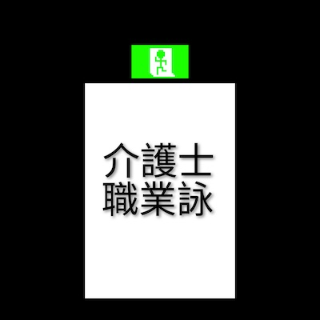
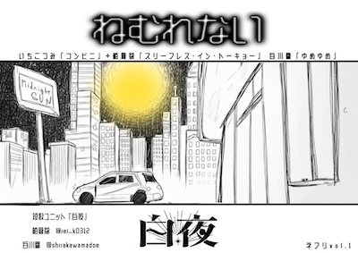
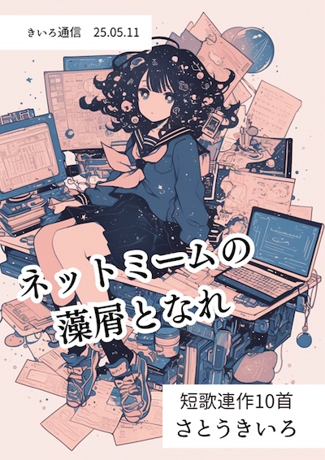

# 作品一覧（文学PDF祭 2025）

> **利用について**
>  
> 本ページに掲載されている作品の著作権は、各作者に帰属します。  
> 利用条件の詳細については、以下をご確認ください。
> 
> - [README.md（作品の利用方針）](../../../../README.md)
> - [LICENSE.txt（ライセンス全文）](../../../../LICENSE.txt)

## 002 たんかいご

[download](works/002.pdf)
*発行日：2025/09/22*

現役介護士が十年を振り返り編んだ職業詠連作の短歌ネプリです。

（非常口ドット [@hijyouguchi_dot](https://x.com/hijyouguchi_dot)） [関連](https://note.com/hijouguchidot)

---

## 003 遥かなムーンライト
[download](works/003.pdf)
*発行日：2025/04/09*

4月に発行した20首連作のネプリです。幻想的な夜をテーマにしたつもりです。

（佐竹紫円 [@shienkotonoha](https://x.com/shienkotonoha)）

---

## 004 泡になる街
[download](works/004.pdf)
*発行日：2025/08/01*

8月に配信したネプリです。ファンタジーをテーマにした15首連作です。

（佐竹紫円 [@shienkotonoha](https://x.com/shienkotonoha)）

---

## 005 白夜ネプリvol.1「ねむれない」

[download](works/005.pdf)
*発行日：2025/11/07*

白川譽(@shirakawamadoe),柏倉茘(@rei_k0312)の2人による短歌ユニット「白夜」の初ネプリ。コンビニ、眠れない夜をテーマに計48首掲載しています。

（白夜 [@rei_k0312](https://x.com/rei_k0312)） [関連](https://x.com/rei_k0312/status/2001129570536448013?s=46)

---

## 006 花森遊梨アンソロジー　アンドロメダによろしく
[download](works/006.pdf)

初めて生活圏内に同人イベント？参加したくても本がねえ。　作るか。遅増料金なんて怖かねえ‼︎ そんな思いで初めて作られた一冊。Xのタイムラインで出てくるようなシャレオツな本が同人誌のスタンダードだと思ったら大間違いなんだよ‼︎

（ポピーザライター [@kVf1iWXsTc82316](https://x.com/kVf1iWXsTc82316)） [関連](https://kakuyomu.jp/users/STRENGH081224)

---

## 007 ネットミームの藻屑となれ

[download](works/007.pdf)
*発行日：2025/05/11*

2025年5月の文学フリマで発行したペーパーです。 インターネットとサブカルチャーな青春10首。

（さとうきいろ [@sugar_section](https://x.com/sugar_section)）

---

## 008 花の籠
[download](works/008.pdf)
*発行日：2025/05/01*

花がテーマの連作短歌です！ネプリとして配布しました。

（個人の筆名 [@aco_kojin](https://x.com/aco_kojin)） [関連](https://note.com/rich_oxalis466)

---
