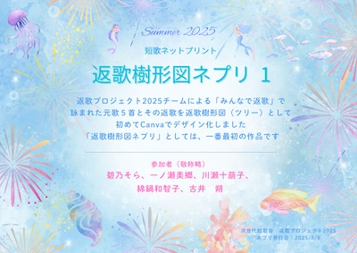
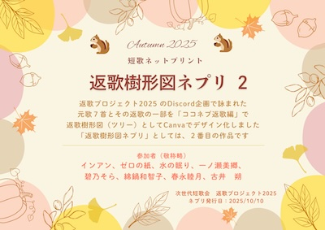
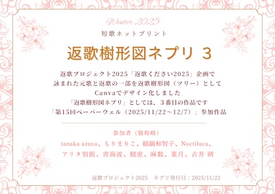
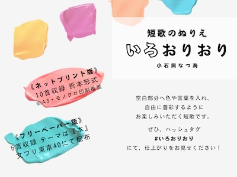
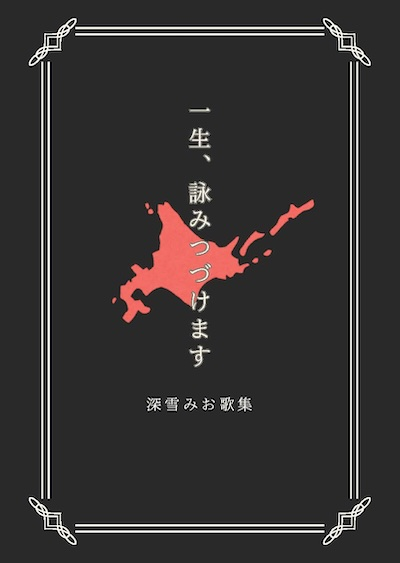
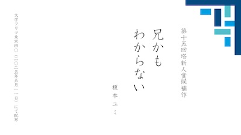
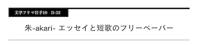
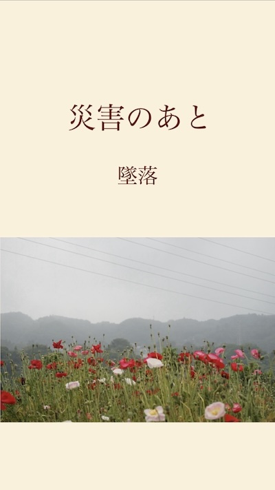
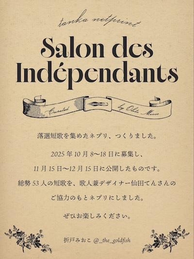
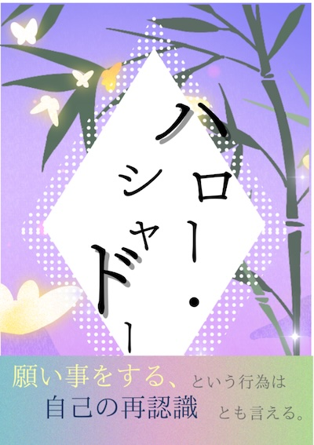

# 作品一覧（文学PDF祭 2025）

> **利用について**
>  
> 本ページに掲載されている作品の著作権は、各作者に帰属します。  
> 利用条件の詳細については、以下をご確認ください。
> 
> - [README.md（作品の利用方針）](../../../../README.md)
> - [LICENSE.txt（ライセンス全文）](../../../../LICENSE.txt)

## たんかいご

- [download](https://drive.google.com/open?id=1zUqZSVMUuQ1zlG5RYxhOI2PotJvo-C1O)
- [文学Git](works/002.pdf)
- *発行日：2025/09/22*

現役介護士が十年を振り返り編んだ職業詠連作の短歌ネプリです。

- （非常口ドット [@hijyouguchi_dot](https://x.com/hijyouguchi_dot)） [関連](https://note.com/hijouguchidot)

---

## 遥かなムーンライト
- [download](https://drive.google.com/open?id=1Bo2IQrWB_4dGgnqyjxBYj0ziNDl2QcLO)
- [文学Git](works/003.pdf)
- *発行日：2025/04/09*

4月に発行した20首連作のネプリです。幻想的な夜をテーマにしたつもりです。

- （佐竹紫円 [@shienkotonoha](https://x.com/shienkotonoha)）

---

## 泡になる街
- [download](https://drive.google.com/open?id=158B6nSl-VmpRmhh4mphKTt8Vlkq488ze)
- [文学Git](works/004.pdf)
- *発行日：2025/08/01*

8月に配信したネプリです。ファンタジーをテーマにした15首連作です。

- （佐竹紫円 [@shienkotonoha](https://x.com/shienkotonoha)）

---

## 白夜ネプリvol.1「ねむれない」

- [download](https://drive.google.com/open?id=1gGrqJHOEEV6PFK1d-O-yMjA2LsH3DZMr)
- [文学Git](works/005.pdf)
- *発行日：2025/11/07*

白川譽(@shirakawamadoe),柏倉茘(@rei_k0312)の2人による短歌ユニット「白夜」の初ネプリ。コンビニ、眠れない夜をテーマに計48首掲載しています。

- （白夜 [@rei_k0312](https://x.com/rei_k0312)） [関連](https://x.com/rei_k0312/status/2001129570536448013?s=46)

---

## 花森遊梨アンソロジー　アンドロメダによろしく
- [download](https://drive.google.com/open?id=1xCEr52w2LB3G16Z86PRe-beqrA6VQdDu)
- [文学Git](works/006.pdf)

初めて生活圏内に同人イベント？参加したくても本がねえ。　作るか。遅増料金なんて怖かねえ‼︎ そんな思いで初めて作られた一冊。Xのタイムラインで出てくるようなシャレオツな本が同人誌のスタンダードだと思ったら大間違いなんだよ‼︎

- （ポピーザライター [@kVf1iWXsTc82316](https://x.com/kVf1iWXsTc82316)） [関連](https://kakuyomu.jp/users/STRENGH081224)

---

## ネットミームの藻屑となれ

- [download](https://drive.google.com/open?id=1qszXi-_6yaqiXjWGkyxy7NPDAw3fyDyW)
- [文学Git](works/007.pdf)
- *発行日：2025/05/11*

2025年5月の文学フリマで発行したペーパーです。 インターネットとサブカルチャーな青春10首。

- （さとうきいろ [@sugar_section](https://x.com/sugar_section)）

---

## イラスト×短歌
- [download](https://drive.google.com/open?id=17pau-Sg_CaNs0eRCe4Y8q9g6PbBY-bdt)
- [文学Git](works/009.pdf)
- *発行日：2025/01/07*

自作のイラスト３枚と短歌２つを組み合わせた博物館チケット風の作品です。

- （わづか [@wa_du_ka_](https://x.com/wa_du_ka_)） [関連](https://x.com/wa_du_ka_/status/1876619417976820110?s=46)

---

## 返歌樹形図ネプリ １「みんなで返歌」

- [download](https://drive.google.com/open?id=1ggVj6dvBaxBABIpr0TV1i0hYr5bI1D8i)
- [文学Git](works/010.pdf)
- *発行日：2025/08/08*

返歌プロジェクト2025チームで詠まれた元歌と返歌を初めて返歌樹形図（ツリー）にデザイン化しました https://note.com/saku_furui/n/n41d76e548131

- （次世代短歌会　返歌プロジェクト2025 [@saku_furui](https://x.com/saku_furui)） [関連](https://x.com/saku_furui/status/1953958693701398807)

---

## 返歌樹形図ネプリ ２「ココネプ返歌編」

- [download](https://drive.google.com/open?id=1PTuEkFiyLe85J8hxBKeCKLS4srcDLH50)
- [文学Git](works/011.pdf)
- *発行日：2025/10/10*

返歌プロジェクト2025 で詠まれた元歌と返歌をDiscord「ココネプ返歌編」で返歌樹形図（ツリー）としてデザイン化しました https://note.com/saku_furui/n/n17f8c094cc8e

- （次世代短歌会　返歌プロジェクト2025 [@saku_furui](https://x.com/saku_furui)） [関連](https://x.com/saku_furui/status/1976311061335900207)

---

## 返歌樹形図ネプリ ３「返歌ください2025」

- [download](https://drive.google.com/open?id=1OaKmuKFNuc9z1nZAfLB5jTpDhSgCnEQy)
- [文学Git](works/012.pdf)
- *発行日：2025/11/22*

返歌プロジェクト2025 「返歌ください2025」企画で詠まれた元歌と返歌の一部を返歌樹形図（ツリー）としてデザイン化しました。 「第15回ぺーパーウェル（2025/11/22～12/7）」参加作品 https://note.com/saku_furui/n/n5b6ac1079c4b

- （返歌プロジェクト2025 [@saku_furui](https://x.com/saku_furui)） [関連](https://x.com/saku_furui/status/1992016947043827868)

---

## ベルキの日記002
- [download](https://drive.google.com/open?id=1QVKWkIceqm41Nob_w0Beb5PtHAsXuKha)
- [文学Git](works/013.pdf)
- *発行日：2025/08/16*

短歌一首+エッセイ『ベルキの日記』です

- （鈴木ベルキ [@pandakirinkaba](https://x.com/pandakirinkaba)） [関連](https://x.com/pandakirinkaba/)

---

## ベルキの日記003
- [download](https://drive.google.com/open?id=1sA2rvSZG8GPYWlVKYKX1--2qoIltBLb_)
- [文学Git](works/014.pdf)
- *発行日：2025/11/30*

短歌一首+エッセイ『ベルキの日記』です

- （鈴木ベルキ [@pandakirinkaba](https://x.com/pandakirinkaba)） [関連](https://x.com/pandakirinkaba/)

---

## 自解の公式

- [download](https://drive.google.com/open?id=1LoEx_96WU2151WmN8SKa2IQPZibyeKXZ)
- [文学Git](works/016.pdf)
- *発行日：2025/12/23*

こんにちは、ねしこです。 この作品は、一人で溜め込んで、息苦しくなって、爆発しそうになった数学の時間に書いた詩をまとめたものです。 どんなに嫌なものでも、式にすれば、少しは綺麗になるんじゃないかなって思って書きました。 この作品を読んだ貴方の心が、少しでも濾過されたなら本望です。 見つけてくれてありがとう。

- （ねしこ [@nehara_mimiko](https://x.com/nehara_mimiko)）

---

## 貴族でありdrifter
- [download](https://drive.google.com/open?id=1fUf9kZiiW5KiSHICfdAMNv90ElcMeIZ-)
- [文学Git](works/017.pdf)
- *発行日：2025/08/01*

2025年夏、北海道にいた頃の連作です。農業をやっていました。

- （展翅零 [@mjppdgwpJ](https://x.com/mjppdgwpJ)）

---

## 詩斗燐　PDF版特別号
- [download](https://drive.google.com/open?id=1hBKl8ESOdVKHeXVySgd40TYgcHod-Eyv)
- [文学Git](works/018.pdf)
- *発行日：2025/12/23*

『詩斗燐』ネプリポエム通信と称して不定期で詩作品を発行しています。通常は出力して折本の形で読んでいただいていますが、今回は一篇１ページにまとめました。

- （小林ブルー美由起 [@YAMItoBlue](https://x.com/YAMItoBlue)） [関連](https://note.com/calm_ixora873)

---

## gsr tape vol.2
- [download](https://drive.google.com/open?id=10LCHvZUTjewWhU2VYXaGGTfrGGysRChq)
- [文学Git](works/019.pdf)
- *発行日：2025/11/14*

詩歌ユニット(鈴木龍也@tatsuyvszk林やは@yahanoheya) 連絡先→greysheepromance@gmail.com

- （grey sheep romance [@greysheepromans](https://x.com/greysheepromans)）

---

## 短歌集『はねず日記』
- [download](https://drive.google.com/open?id=12Nji_A8PtlKwUvgfD-X6gJWLGS6BMDr9)
- [文学Git](works/022.pdf)
- [download-2](https://drive.google.com/open?id=1nUtPfTSxt4t-Zuz9IAmqZGrMQA7XvEq0)
- [文学Git-2](works/022-2.pdf)
- *発行日：2025/01/27*

過去にX（旧Twitter）にて投稿・公開した短歌を収録しており、頒布にあたって、幾つか推敲しました。

- （鹿江　朱華 [@hnz97713518](https://x.com/hnz97713518)） [関連](https://x.com/i/status/1873405642138161585)

---

## 月刊短歌十
- [download](https://drive.google.com/open?id=1NtHf4AU8UAjcDE297K9Swc8e2hsBF3yd)
- [文学Git](works/026.pdf)
- [download-2](https://drive.google.com/open?id=1gYxNO52xOW6T3hZkNFs3vIiKvphV-bR9)
- [文学Git-2](works/026-2.pdf)
- [download-3](https://drive.google.com/open?id=1m32tnUoCw_s2Yohiw2RWTs1x8JupfVur)
- [文学Git-3](works/026-3.pdf)
- [download-4](https://drive.google.com/open?id=1fRmxGWUv4WLFRtRUUqyk0Ufg05Mtuc4m)
- [文学Git-4](works/026-4.pdf)
- [download-5](https://drive.google.com/open?id=1o6_pmOLQT3mDPZD8SXTI2fgsZs4cPPft)
- [文学Git-5](works/026-5.pdf)
- [download-6](https://drive.google.com/open?id=16ag4UXFVzL2zXKnDk7VSQprTIFPH1Yrp)
- [文学Git-6](works/026-6.pdf)
- [download-7](https://drive.google.com/open?id=1s24kxSg5dfYaLZzbLsthwInMIMqKs_BA)
- [文学Git-7](works/026-7.pdf)
- [download-8](https://drive.google.com/open?id=1rEd0nwPMivTZMzI-pDVgEM9sE64z-gMy)
- [文学Git-8](works/026-8.pdf)
- [download-9](https://drive.google.com/open?id=1TlpM_bxjF7AJXGVn_W5YzXoZykGiAFxV)
- [文学Git-9](works/026-9.pdf)
- [download-10](https://drive.google.com/open?id=1152aEBJnMvmIFSRvjbZNp6_DkoZOFnDm)
- [文学Git-10](works/026-10.pdf)

月刊短歌十として発表された10首程度の連作×10人によるネプリです。全十号。

- （吉田岬,鳳凰原岬 [@2000misaki0323](https://x.com/2000misaki0323)）

---

## 蜂十蜂
- [download](https://drive.google.com/open?id=1Go7p7BlBVQYim9IfPGd8VzX2VzhNEHBU)
- [文学Git](works/027.pdf)

「女王蜂」の歌詞から発想した短歌を集めたものです。全88首。編集ははるかぜ様

- （吉田岬 [@2000misaki0323](https://x.com/2000misaki0323)）

---

## ワールドトリガー　迅悠一について
- [download](https://drive.google.com/open?id=1uZk9kkNBHr1i5VM9kLsYUvSgjXN3wg7H)
- [文学Git](works/029.pdf)
- *発行日：2025/10/23*

ワールドトリガーに登場する迅悠一という人物について、考えまくった短歌です。いわゆる二次創作です。 ほぼオタクの捏造ですが、彼への愛はあります。迅悠一に幸あれ。

- （和子 [@nunuo_03](https://x.com/nunuo_03)）

---

## 大人の童謡紙「かげぼうし」
- [download](https://drive.google.com/open?id=1PdslTG9AG8yoRZh7sWMJkvV8not_-C4m)
- [文学Git](works/030.pdf)
- [download-2](https://drive.google.com/open?id=1ttnJiMPj4DRdjggsPqQC9PAQbQ8xEM6I)
- [文学Git-2](works/030-2.pdf)
- [download-3](https://drive.google.com/open?id=1Xn7zQ4j-8nxiEXxZtp2-M7fRIwHf8Ovc)
- [文学Git-3](works/030-3.pdf)
- *発行日：2025/09/15*

月に1回、個人で発行しているネットプリントのバックナンバーです。 A4用紙で、右綴じの製本(小冊子)モード印刷をすることを想定しています。  今月号はコンビニ(ローソン・ファミリーマート・ミニストップ・ポプラ)のマルチコピー機で「XDZPAAF77U」と入力すると印刷できます。

- （入山夜鷸 [@812_iri](https://x.com/812_iri)） [関連](https://note.com/812_irym/n/n541dc595a326)

---

## 感魚室(試し読み)
- [download](https://drive.google.com/open?id=1fh0xUS-CAje0T8PAVP7q6RWqDBIoE7h3)
- [文学Git](works/031.pdf)
- *発行日：2025/08/05*

タイトルは「うをのぞき」と読みます。水族館の詩を集めて詩集を作っているので、出来上がる前の「味見」として公開しているものです。

- （入山夜鷸 [@812_iri](https://x.com/812_iri)） [関連](https://yaits.booth.pm/items/7576226)

---

## 鯨の文字盤
- [download](https://drive.google.com/open?id=1KRsDl_3knyUb-TT3aRH8V6_5NozuHa6u)
- [文学Git](works/032.pdf)
- *発行日：2025/10/21*

作曲家・白葉くじ様の音楽を聴いて浮かんだ詩をまとめたものです。

- （入山夜鷸 [@812_iri](https://x.com/812_iri)） [関連](https://yaits.booth.pm/items/7571068)

---

## 短歌のぬりえ　いろおりおり

- [download](https://drive.google.com/open?id=1avOtEXedzfS2Nj9M37TXCxpQtvLW0mCn)
- [文学Git](works/033.pdf)
- [download-2](https://drive.google.com/open?id=1C9Ge0WN-486onry0EQ64BN4LV2XP9Knb)
- [文学Git-2](works/033-2.pdf)

空白部分へ色や単語を入れて、自由に言葉で着彩してお楽しみいただく短歌です。 ふだん短歌を作らない方にも遊んでもらえたら嬉しいです。

- （小石岡なつ海 [@7snooze](https://x.com/7snooze)） [関連](https://note.com/sio31/n/nb72980f2b9dc)

---

## こけしおとし vol.1
- [download](https://drive.google.com/open?id=1xCQZi6gPa5v_cABZcheiH66oyLVLMY3R)
- [文学Git](works/034.pdf)
- *発行日：2025/10/24*

長田資融、不束こけしそれぞれの10首連作が見れるネットプリントです！よろしくお願いいたします。

- （こけしおとし [@Nagata742](https://x.com/Nagata742)） [関連](https://x.com/Nagata742)

---

## 一生、詠みつづけます

- [download](https://drive.google.com/open?id=1fvZHmWE_3dug_J0f9Dp495nbKZzbQeUO)
- [文学Git](works/035.pdf)
- *発行日：2025/12/27*

処女歌集です。自分の「推し」への愛を詰め込んだ歌集になっています。

- （深雪みお [@medication_yuki](https://x.com/medication_yuki)）

---

## SHADOW BLUE
- [download](https://drive.google.com/open?id=1_8QCbNbDB78kRlS5tzbYxAAMw6gNAvie)
- [文学Git](works/036.pdf)
- *発行日：2025/12/27*

2025年の自選短歌をA4一枚にまとめました。 新聞歌壇、雑誌「角川短歌」「短歌研究」投稿欄に採用されたもの等をふくむ21首です。

- （碧乃そら [@hane_ao22](https://x.com/hane_ao22)） [関連](https://note.com/hane_ao22/n/nfc948c54dda2)

---

## 「あかるくない」とその他の連作

- [download](https://drive.google.com/open?id=1t4rp9CO2ACpkt_pmGaRswLHGp2xY_tvY)
- [文学Git](works/037.pdf)
- *発行日：2025/02/10*

5篇の短い短歌連作です。タイトル通り静かな連作が並んでいます。

- （榎本ユミ [@enomotoyumi1007](https://x.com/enomotoyumi1007)） [関連](https://note.com/enomotoyumi1007)

---

## 兄かもわからない

- [download](https://drive.google.com/open?id=1VZq1sl7uLIwI3l40CRS6UnXAYDCFeZVe)
- [文学Git](works/038.pdf)
- *発行日：2025/05/11*

第十五回塔新人賞の候補作となった30首連作です。

- （榎本ユミ [@enomotoyumi1007](https://x.com/enomotoyumi1007)） [関連](https://note.com/enomotoyumi1007)

---

## 怪文書ディスコ　Volume 1

- [download](https://drive.google.com/open?id=1RwyN0NIBLJum6CosUKbLWugnuPjOiKTg)
- [文学Git](works/039.pdf)
- *発行日：2025/11/12*

初めて作った個人ネプリです。短歌とか自由律俳句とか。コンビニでブラックサンダー買ったら小銭がなくなってプリントできなかった方とかもこの機会にどうぞ。

- （汐留ライス [@RCodome](https://x.com/RCodome)） [関連](https://x.com/RCodome/status/1988556882051821887)

---

## 朱_akari_エッセイと短歌のフリーペーパー

- [download](https://drive.google.com/open?id=1TUeHDNqnix1DUkRR0TInT5VmGnjVGNwX)
- [文学Git](works/040.pdf)
- *発行日：2025/06/15*

2025年6月15日に開催された文学フリマ岩手で配布した、エッセイと短歌のフリーペーパーをネプリ登録したものです。当日に販売した私家版歌集の情報も併せて掲載しています。

- （真島朱火 [@shuca_m](https://x.com/shuca_m)） [関連](https://shuca-m.booth.pm/)

---

## 灰皿の上にアイシャドウ落ちた
- [download](https://drive.google.com/open?id=1B-mc1ePZU6GfaXkZZKbW8iINeml9qNYo)
- [文学Git](works/041.pdf)
- *発行日：2025/04/04*

短歌のドローイング作品です。

- （成田遠羽 [@tui_raku](https://x.com/tui_raku)） [関連](https://x.com/tui_raku)

---

## 災害のあと

- [download](https://drive.google.com/open?id=14w_ECsR9sSH9aDkic8HScICBmt29K9KZ)
- [文学Git](works/042.pdf)
- *発行日：2025/11/09*

統合失調症で措置入院したときの話です。

- （成田遠羽 [@tui_raku](https://x.com/tui_raku)） [関連](https://x.com/tui_raku)

---

## サロン・ド・アンデパンダン

- [download](https://drive.google.com/open?id=1bEtDz1W4AiQTUOwLBL8yy8CBe-Shj9Qw)
- [文学Git](works/043.pdf)
- *発行日：2025/11/15*

【落選短歌を集めたネプリ、つくりました】 総勢53人の短歌を、歌人兼デザイナー仙田てんさんのご協力のもとネプリにしました。 ぜひお楽しみください。

- （折戸みおこ [@_the_goldfish_](https://x.com/_the_goldfish_)）

---

## ハロー・シャドー

- [download](https://drive.google.com/open?id=1mHXnYClu9ZDfHRm1oh6CjtJLRAmhRn4R)
- [文学Git](works/044.pdf)
- *発行日：2025/05/24*

願い事をする、という行為は自己の再認識とも言える。 ふたりの男が「願い事をする」とは何に基づく行動なのか考える話。 8P折本仕様のPDFです。

- （早藤尚 [@saclaughingman](https://x.com/saclaughingman)） [関連](https://note.com/saclaughingman)

---

## 暑中お見舞申し上げます
- [download](https://drive.google.com/open?id=1ZpZXxbkNCXlQKykugst1tewFSXlF4d4u)
- [文学Git](works/045.pdf)
- *発行日：2025/07/26*

2025年夏に初めて個人で出したネプリです 夏祭りや花火、身の内の持て余す熱を思い出してもらえたら嬉しいです

- （さんそ [@Kani_Hitsuji](https://x.com/Kani_Hitsuji)）

---

